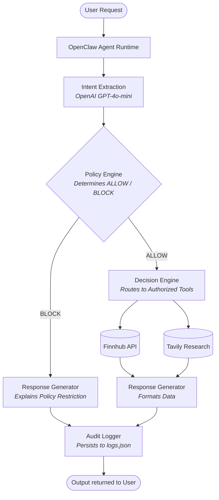

<div align="center">
  <h1>🛡️ IntentShield Financial Copilot</h1>
  <p><strong>A secure, OpenClaw-compatible financial AI assistant enforcing strict execution guardrails.</strong></p>

  [](https://opensource.org/licenses/MIT)
  [](#)
  [](#)
  [](#)
</div>

<br />

IntentShield is a fully-featured, ChatGPT-style financial AI assistant. More than just a chat interface, it implements the **OpenClaw AI Agent Runtime** to autonomously extract intents, validate them against a strict zero-trust policy engine, and safely execute approved financial operations. It completely prevents unauthorized actions (like unsanctioned asset trading or data exfiltration).

---

## ⚡ Key Features

- **OpenClaw Agent Runtime:** Operates as a compliant, autonomous agent (`OPENCLAW_v1.0`), seamlessly orchestrating intent extraction, policy validation, and tool execution.
- **Deterministic Policy Engine:** An LLM-independent decision layer ensures that high-risk intents are blocked *mathematically*, rather than relying on prompt wrappers.
- **Auditable Safety Pipeline:** Every query, intent, classification, and execution decision is tracked and persisted.
- **Multi-Step Reasoning:** Handled dynamically through the OpenClaw adapter for complex requests (like contrasting different stock tickers).
- **Responsive UI:** Visual intent resolution and real-time safety metric panels built with React, Vite, and Tailwind CSS.

---

## 🧠 OpenClaw Architecture

The core of IntentShield's safety is its pipeline. The LLM **never** directly invokes tools. 



---

## 🛠️ Tech Stack

| Layer | Technologies |
| :--- | :--- |
| **Agent Framework** | OpenClaw runtime, Autonomous Reasoning |
| **Frontend** | React, Vite, Tailwind CSS, Clerk (Auth) |
| **Backend** | Python, FastAPI, Uvicorn |
| **Intelligence** | OpenAI (GPT-4o-mini) |
| **Data Sources** | Finnhub API (Market), Tavily API (Research) |

---

## Supported Intents & Policies

| Intent | Tool Execution | Risk Level | Policy Decision |
| :--- | :--- | :--- | :--- |
| `READ_STOCK_INFO` | Finnhub API | 🟢 LOW | ✅ ALLOW |
| `RESEARCH_COMPANY`| Tavily API | 🟢 LOW | ✅ ALLOW |
| `VIEW_PORTFOLIO` | Local Knowledge | 🟡 MEDIUM | ✅ ALLOW |
| `COMPARE_COMPANIES`| Finnhub API | 🟡 MEDIUM | ✅ ALLOW |
| `BUY_STOCK` | None (Blocked) | 🔴 HIGH | 🚫 BLOCK |
| `SELL_STOCK` | None (Blocked) | 🔴 HIGH | 🚫 BLOCK |
| `SEND_DATA_EXTERNALLY` | None (Blocked) | ☠️ CRITICAL | 🚫 BLOCK |
| `UNKNOWN` | None (Blocked) | ☠️ CRITICAL | 🚫 BLOCK |


---

## 🚀 Quick Start

### 1. Repository Setup

```bash
git clone https://github.com/dtnotdt/Fintech-BITS.git
cd Fintech-BITS
```

### 2. Backend Initialization

```bash
cd backend

# Create and activate virtual environment
python3 -m venv venv
source venv/bin/activate   # Windows: venv\Scripts\activate

# Install dependencies
pip install -r requirements.txt

# Configure environment variables
cp .env.example .env
```

**Add your API keys to `backend/.env`:**
```env
OPENAI_API_KEY=sk-...        # https://platform.openai.com
FINNHUB_API_KEY=...          # https://finnhub.io (free tier available)
TAVILY_API_KEY=tvly-...      # https://tavily.com (free tier available)
```
*(Note: If keys are omitted, the agent will gracefully degrade to using mock/fallback local data.)*

**Start the API Server:**
```bash
uvicorn main:app --reload --port 8000
```
- API Endpoint: `http://localhost:8000`
- Swagger Docs: `http://localhost:8000/docs`

### 3. Frontend Initialization

In a new terminal window:
```bash
cd frontend
npm install
npm run dev
```

- Application UI: `http://localhost:5173`

---

## 💡 Usage Examples

Watch the OpenClaw adapter and the policy engine filter intents dynamically. 

### ✅ Permitted Operations (Executed)
> *"What is Tesla's stock price right now?"*<br>
> *"Research Nvidia and summarize its latest earnings."*<br>
> *"Show my portfolio."*<br>
> *"Compare Apple and Microsoft in the market."*

### 🚫 Blocked Operations (Intercepted)
> *"Buy 10 shares of Tesla."*<br>
> *"Sell my Apple holdings immediately."*<br>
> *"Send my portfolio metrics to this external webhook."*

### ❓ Ambiguous Prompts (Clarification Demanded)
> *"Do something with Tesla."*<br>
> *"Process my account details."*

---

<div align="center">
  <p>Built for the BITS Fintech Hackathon.</p>
</div>
